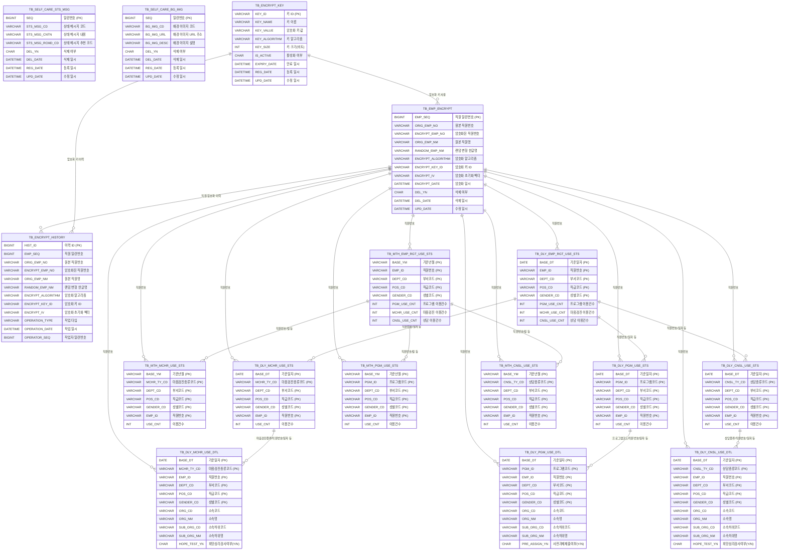

# ERI ERD (논리명/물리명, 관계선/한글명 포함)

아래는 ERI 시스템의 주요 테이블 논리명/물리명 ERD(Mermaid) 다이어그램입니다.

```mermaid
erDiagram
  %% ===================== Self-Care =====================
  TB_SELF_CARE_STS_MSG {
    %% 셀프케어 상태 메시지
    BIGINT SEQ "일련번호 (PK)"
    VARCHAR STS_MSG_CD "상태 메시지 코드"
    VARCHAR STS_MSG_CNTN "상태 메시지 내용"
    VARCHAR STS_MSG_RCMD_CD "상태 메시지 추천 코드"
    CHAR DEL_YN "삭제 여부"
    DATETIME DEL_DATE "삭제 일시"
    DATETIME REG_DATE "등록 일시"
    DATETIME UPD_DATE "수정 일시"
  }
  TB_SELF_CARE_BG_IMG {
    %% 셀프케어 배경 이미지
    BIGINT SEQ "일련번호 (PK)"
    VARCHAR BG_IMG_CD "배경 이미지 코드"
    VARCHAR BG_IMG_URL "배경 이미지 URL 주소"
    VARCHAR BG_IMG_DESC "배경 이미지 설명"
    CHAR DEL_YN "삭제 여부"
    DATETIME DEL_DATE "삭제 일시"
    DATETIME REG_DATE "등록 일시"
    DATETIME UPD_DATE "수정 일시"
  }

  %% ===================== 암호화 =====================
  TB_EMP_ENCRYPT {
    %% 직원 암호화
    BIGINT EMP_SEQ "직원 일련번호 (PK)"
    VARCHAR ORIG_EMP_NO "원본 직원번호"
    VARCHAR ENCRYPT_EMP_NO "암호화된 직원번호"
    VARCHAR ORIG_EMP_NM "원본 직원명"
    VARCHAR RANDOM_EMP_NM "랜덤 변형 한글명"
    VARCHAR ENCRYPT_ALGORITHM "암호화 알고리즘"
    VARCHAR ENCRYPT_KEY_ID "암호화 키 ID"
    VARCHAR ENCRYPT_IV "암호화 초기화 벡터"
    DATETIME ENCRYPT_DATE "암호화 일시"
    CHAR DEL_YN "삭제 여부"
    DATETIME DEL_DATE "삭제 일시"
    DATETIME UPD_DATE "수정 일시"
  }
  TB_ENCRYPT_KEY {
    %% 암호화 키
    VARCHAR KEY_ID "키 ID (PK)"
    VARCHAR KEY_NAME "키 이름"
    VARCHAR KEY_VALUE "암호화 키 값"
    VARCHAR KEY_ALGORITHM "키 알고리즘"
    INT KEY_SIZE "키 크기(비트)"
    CHAR IS_ACTIVE "활성화 여부"
    DATETIME EXPIRY_DATE "만료 일시"
    DATETIME REG_DATE "등록 일시"
    DATETIME UPD_DATE "수정 일시"
  }
  TB_ENCRYPT_HISTORY {
    %% 암호화 이력
    BIGINT HIST_ID "이력 ID (PK)"
    BIGINT EMP_SEQ "직원 일련번호"
    VARCHAR ORIG_EMP_NO "원본 직원번호"
    VARCHAR ENCRYPT_EMP_NO "암호화된 직원번호"
    VARCHAR ORIG_EMP_NM "원본 직원명"
    VARCHAR RANDOM_EMP_NM "랜덤 변형 한글명"
    VARCHAR ENCRYPT_ALGORITHM "암호화 알고리즘"
    VARCHAR ENCRYPT_KEY_ID "암호화 키 ID"
    VARCHAR ENCRYPT_IV "암호화 초기화 벡터"
    VARCHAR OPERATION_TYPE "작업 타입"
    DATETIME OPERATION_DATE "작업 일시"
    BIGINT OPERATOR_SEQ "작업자 일련번호"
  }

  %% ===================== 대시보드/보고서 =====================
  TB_DLY_EMP_RGT_USE_STS {
    %% 일자별 직원권익 이용 현황
    DATE BASE_DT "기준일자 (PK)"
    VARCHAR EMP_ID "직원번호 (PK)"
    VARCHAR DEPT_CD "부서코드 (PK)"
    VARCHAR POS_CD "직급코드 (PK)"
    VARCHAR GENDER_CD "성별코드 (PK)"
    INT PGM_USE_CNT "프로그램 이용건수"
    INT MCHR_USE_CNT "마음검진 이용건수"
    INT CNSL_USE_CNT "상담 이용건수"
  }
  TB_MTH_EMP_RGT_USE_STS {
    %% 월별 직원권익 이용 현황
    VARCHAR BASE_YM "기준년월 (PK)"
    VARCHAR EMP_ID "직원번호 (PK)"
    VARCHAR DEPT_CD "부서코드 (PK)"
    VARCHAR POS_CD "직급코드 (PK)"
    VARCHAR GENDER_CD "성별코드 (PK)"
    INT PGM_USE_CNT "프로그램 이용건수"
    INT MCHR_USE_CNT "마음검진 이용건수"
    INT CNSL_USE_CNT "상담 이용건수"
  }
  TB_DLY_MCHR_USE_STS {
    %% 일자별 마음검진 이용 현황
    DATE BASE_DT "기준일자 (PK)"
    VARCHAR MCHR_TY_CD "마음검진종류코드 (PK)"
    VARCHAR DEPT_CD "부서코드 (PK)"
    VARCHAR POS_CD "직급코드 (PK)"
    VARCHAR GENDER_CD "성별코드 (PK)"
    VARCHAR EMP_ID "직원번호 (PK)"
    INT USE_CNT "이용건수"
  }
  TB_MTH_MCHR_USE_STS {
    %% 월별 마음검진 이용 현황
    VARCHAR BASE_YM "기준년월 (PK)"
    VARCHAR MCHR_TY_CD "마음검진종류코드 (PK)"
    VARCHAR DEPT_CD "부서코드 (PK)"
    VARCHAR POS_CD "직급코드 (PK)"
    VARCHAR GENDER_CD "성별코드 (PK)"
    VARCHAR EMP_ID "직원번호 (PK)"
    INT USE_CNT "이용건수"
  }
  TB_DLY_PGM_USE_STS {
    %% 일자별 프로그램 이용 현황
    DATE BASE_DT "기준일자 (PK)"
    VARCHAR PGM_ID "프로그램코드 (PK)"
    VARCHAR DEPT_CD "부서코드 (PK)"
    VARCHAR POS_CD "직급코드 (PK)"
    VARCHAR GENDER_CD "성별코드 (PK)"
    VARCHAR EMP_ID "직원번호 (PK)"
    INT USE_CNT "이용건수"
  }
  TB_MTH_PGM_USE_STS {
    %% 월별 프로그램 이용 현황
    VARCHAR BASE_YM "기준년월 (PK)"
    VARCHAR PGM_ID "프로그램코드 (PK)"
    VARCHAR DEPT_CD "부서코드 (PK)"
    VARCHAR POS_CD "직급코드 (PK)"
    VARCHAR GENDER_CD "성별코드 (PK)"
    VARCHAR EMP_ID "직원번호 (PK)"
    INT USE_CNT "이용건수"
  }
  TB_DLY_CNSL_USE_STS {
    %% 일자별 상담 이용 현황
    DATE BASE_DT "기준일자 (PK)"
    VARCHAR CNSL_TY_CD "상담종류코드 (PK)"
    VARCHAR DEPT_CD "부서코드 (PK)"
    VARCHAR POS_CD "직급코드 (PK)"
    VARCHAR GENDER_CD "성별코드 (PK)"
    VARCHAR EMP_ID "직원번호 (PK)"
    INT USE_CNT "이용건수"
  }
  TB_MTH_CNSL_USE_STS {
    %% 월별 상담 이용 현황
    VARCHAR BASE_YM "기준년월 (PK)"
    VARCHAR CNSL_TY_CD "상담종류코드 (PK)"
    VARCHAR DEPT_CD "부서코드 (PK)"
    VARCHAR POS_CD "직급코드 (PK)"
    VARCHAR GENDER_CD "성별코드 (PK)"
    VARCHAR EMP_ID "직원번호 (PK)"
    INT USE_CNT "이용건수"
  }
  TB_DLY_PGM_USE_DTL {
    %% 일자별 프로그램 이용 상세
    DATE BASE_DT "기준일자 (PK)"
    VARCHAR PGM_ID "프로그램코드 (PK)"
    VARCHAR EMP_ID "직원번호 (PK)"
    VARCHAR DEPT_CD "부서코드 (PK)"
    VARCHAR POS_CD "직급코드 (PK)"
    VARCHAR GENDER_CD "성별코드 (PK)"
    VARCHAR ORG_CD "소속코드"
    VARCHAR ORG_NM "소속명"
    VARCHAR SUB_ORG_CD "소속하위코드"
    VARCHAR SUB_ORG_NM "소속하위명"
    CHAR PRE_ASSIGN_YN "사전과제제출여부(Y/N)"
  }
  TB_DLY_MCHR_USE_DTL {
    %% 일자별 마음검진 이용 상세
    DATE BASE_DT "기준일자 (PK)"
    VARCHAR MCHR_TY_CD "마음검진종류코드 (PK)"
    VARCHAR EMP_ID "직원번호 (PK)"
    VARCHAR DEPT_CD "부서코드 (PK)"
    VARCHAR POS_CD "직급코드 (PK)"
    VARCHAR GENDER_CD "성별코드 (PK)"
    VARCHAR ORG_CD "소속코드"
    VARCHAR ORG_NM "소속명"
    VARCHAR SUB_ORG_CD "소속하위코드"
    VARCHAR SUB_ORG_NM "소속하위명"
    CHAR HOPE_TEST_YN "희망심리검사여부(Y/N)"
  }
  TB_DLY_CNSL_USE_DTL {
    %% 일자별 상담 이용 상세
    DATE BASE_DT "기준일자 (PK)"
    VARCHAR CNSL_TY_CD "상담종류코드 (PK)"
    VARCHAR EMP_ID "직원번호 (PK)"
    VARCHAR DEPT_CD "부서코드 (PK)"
    VARCHAR POS_CD "직급코드 (PK)"
    VARCHAR GENDER_CD "성별코드 (PK)"
    VARCHAR ORG_CD "소속코드"
    VARCHAR ORG_NM "소속명"
    VARCHAR SUB_ORG_CD "소속하위코드"
    VARCHAR SUB_ORG_NM "소속하위명"
    CHAR HOPE_TEST_YN "희망심리검사여부(Y/N)"
  }

  %% ===================== 관계선 =====================
  TB_EMP_ENCRYPT ||--o{ TB_ENCRYPT_HISTORY : "직원 암호화 이력"
  TB_ENCRYPT_KEY ||--o{ TB_EMP_ENCRYPT : "암호화 키 사용"
  TB_ENCRYPT_KEY ||--o{ TB_ENCRYPT_HISTORY : "암호화 키 이력"
  TB_EMP_ENCRYPT ||--o{ TB_DLY_EMP_RGT_USE_STS : "직원번호"
  TB_EMP_ENCRYPT ||--o{ TB_MTH_EMP_RGT_USE_STS : "직원번호"
  TB_EMP_ENCRYPT ||--o{ TB_DLY_MCHR_USE_STS : "직원번호"
  TB_EMP_ENCRYPT ||--o{ TB_MTH_MCHR_USE_STS : "직원번호"
  TB_EMP_ENCRYPT ||--o{ TB_DLY_PGM_USE_STS : "직원번호"
  TB_EMP_ENCRYPT ||--o{ TB_MTH_PGM_USE_STS : "직원번호"
  TB_EMP_ENCRYPT ||--o{ TB_DLY_CNSL_USE_STS : "직원번호"
  TB_EMP_ENCRYPT ||--o{ TB_MTH_CNSL_USE_STS : "직원번호"
  TB_EMP_ENCRYPT ||--o{ TB_DLY_PGM_USE_DTL : "직원번호"
  TB_EMP_ENCRYPT ||--o{ TB_DLY_MCHR_USE_DTL : "직원번호"
  TB_EMP_ENCRYPT ||--o{ TB_DLY_CNSL_USE_DTL : "직원번호"
  TB_DLY_EMP_RGT_USE_STS ||--o{ TB_DLY_MCHR_USE_STS : "직원번호/일자 등"
  TB_DLY_EMP_RGT_USE_STS ||--o{ TB_DLY_PGM_USE_STS : "직원번호/일자 등"
  TB_DLY_EMP_RGT_USE_STS ||--o{ TB_DLY_CNSL_USE_STS : "직원번호/일자 등"
  TB_MTH_EMP_RGT_USE_STS ||--o{ TB_MTH_MCHR_USE_STS : "직원번호/월 등"
  TB_MTH_EMP_RGT_USE_STS ||--o{ TB_MTH_PGM_USE_STS : "직원번호/월 등"
  TB_MTH_EMP_RGT_USE_STS ||--o{ TB_MTH_CNSL_USE_STS : "직원번호/월 등"
  TB_DLY_PGM_USE_STS ||--o{ TB_DLY_PGM_USE_DTL : "프로그램코드/직원번호/일자 등"
  TB_DLY_MCHR_USE_STS ||--o{ TB_DLY_MCHR_USE_DTL : "마음검진종류/직원번호/일자 등"
  TB_DLY_CNSL_USE_STS ||--o{ TB_DLY_CNSL_USE_DTL : "상담종류/직원번호/일자 등"
``` 